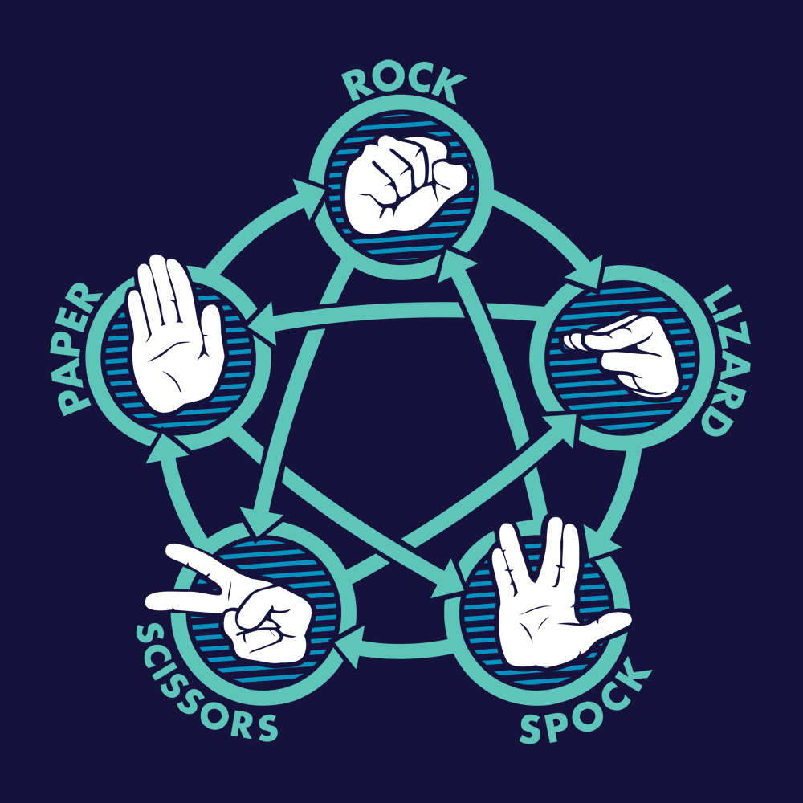

# Rock Paper Scissors Lizard Spock!

TODO: Write a project description

## Installation

First project built in Python 3; you may need to update you local installation(s) here.

Windows:Get Phyton 3!
Mac (should be built in): Upgrade to Python 3
Lunix (should be built in): Upgrade to Python 3

## Contributing

1. Fork it!
2. Create your feature branch: `git checkout -b my-new-feature`
3. Commit your changes: `git commit -am 'Add some feature'`
4. Push to the branch: `git push origin my-new-feature`
5. Submit a pull request :D

## Credits

TODO: Write credits --> list yourself, team members, anywhere where you are getting references (code, visual references, etc.)

## License

MIT
MSS

Made a change